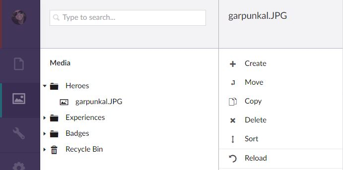
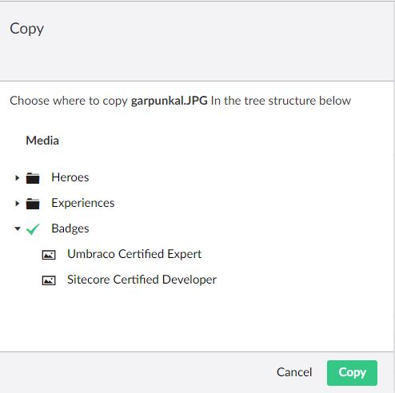
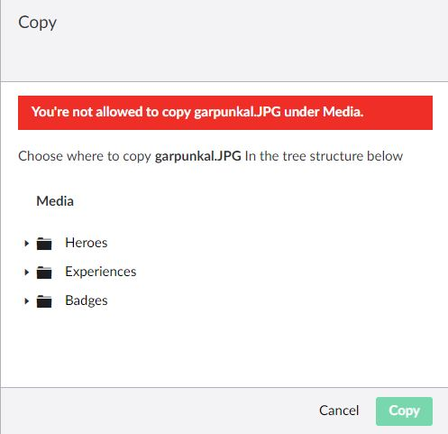
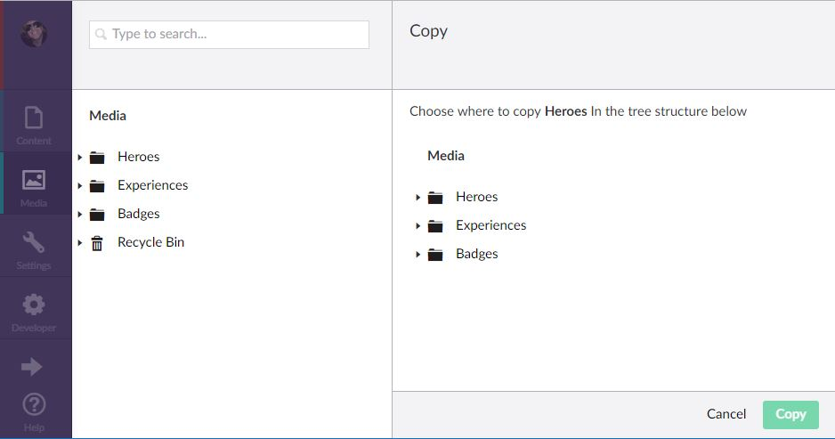

# Umbraco MediaCopy

A simple app_plugin for Umbraco with a supporting project that allows you to copy media.  

The plugin allows you to copy individual media files or folders. 

- Allowed types permission is respected. 
- The user permission model is respected, turning copy functionality off based on permission. 
- It copies crops and focal points for each image by essentially copying the JSON output and replacing the image source.
- It prevents copying to self for circular copying.
- It can be fully localised, supporting en-GB by default. 
- It uses AutoFac to handle dependencies.

## Basic Requirements

- Umbraco 7.11.1 and above
- AutoFac 4.8.1 and above

## Screenshots

### Context Menu

### Action Menu

### Restrictions

### Folder Copy

## Instructions
1. Import the MediaCopy project into your solution. 
2. Add reference to MediaCopy project in your Umbraco website project. 
2. Copy the App_Plugins folder into your Umbraco website project. 
3. This will enable the copy functionality in our Umbraco instance. 
